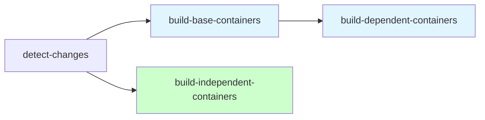

# Containers

This directory contains custom container image definitions for the homelab infrastructure.

## Structure

Each sub-directory represents a separate container image:

```
containers/
├── <container-name>/
│   ├── Containerfile      # OCI-compliant container definition
│   ├── README.md          # Container description and usage
│   └── .containerignore   # Files to exclude from build context
```

## Building Containers

Build a container locally using Podman:

```bash
cd containers/<container-name>
podman build -t <container-name>:latest .
```

Or with Docker:

```bash
cd containers/<container-name>
docker build -f Containerfile -t <container-name>:latest .
```

## Container Dependencies

The CI build system automatically handles container dependencies using a naming convention and explicit configuration:

### Dependency Categories

1. **Base Containers** (Auto-detected)
   - Containers with names ending in `-base`
   - Built first in the pipeline
   - Example: `devspace-base`

2. **Dependent Containers** (Explicitly Listed)
   - Containers that depend on base containers
   - Listed in `.github/workflows/container-build.yml` under `DEPENDENT_CONTAINERS`
   - Built after base containers complete
   - Example: `devspace-homelab` (depends on `devspace-base`)

3. **Independent Containers** (All Others)
   - Containers that don't depend on other project containers
   - Build in parallel with base containers
   - Example: `hf-cli`

### Build Order



**Pipeline Stages:**
1. **Base containers** build first (e.g., `devspace-base`)
2. **Independent containers** build in parallel with base (e.g., `hf-cli`)
3. **Dependent containers** build after base completes (e.g., `devspace-homelab`)

### Adding New Containers

**For a new base container:**
- Name it with the `-base` suffix (e.g., `myapp-base`)
- No workflow configuration needed (auto-detected)

**For a container depending on a base:**
- Add container name to `DEPENDENT_CONTAINERS` in `.github/workflows/container-build.yml`
- Reference the base image in your `FROM` statement

**For an independent container:**
- No special configuration needed
- Will build in parallel with base containers

### Example Dependency Structure

Current containers:
- `devspace-base` → Base container (auto-detected by `-base` suffix)
- `devspace-homelab` → Depends on `devspace-base` (explicitly listed)
- `hf-cli` → Independent container

## Conventions

- Use `Containerfile` (OCI standard) rather than `Dockerfile`
- Include a `README.md` describing the container's purpose
- Include a `.containerignore` to minimize build context
- Use meaningful labels in the Containerfile
- **All containers must support both arm64 and x86_64 (amd64) architectures**
  - Use `ARG TARGETARCH` for architecture detection during multi-platform builds
  - Download architecture-specific binaries using conditional logic based on `$TARGETARCH`
- **Use `-base` suffix for base containers** that other containers will depend on
