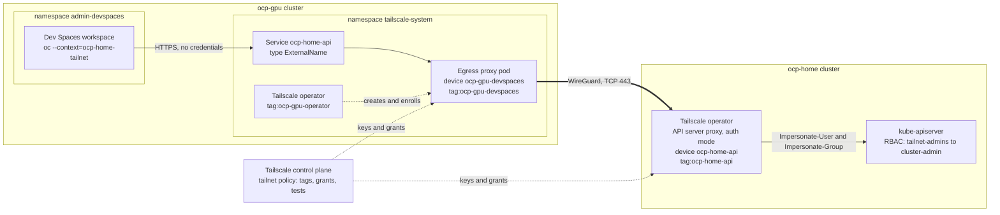
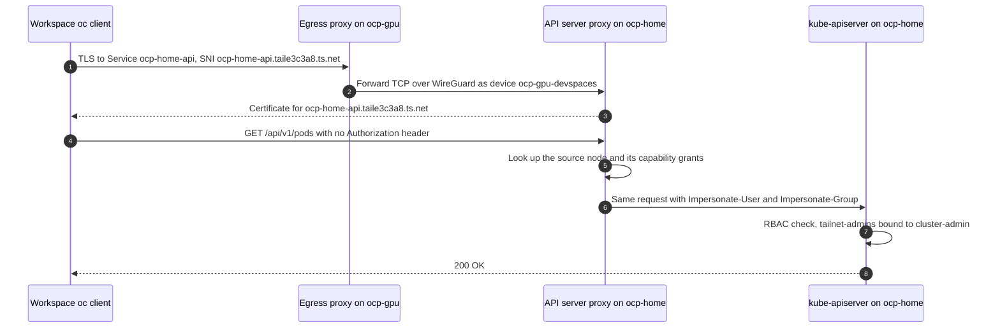
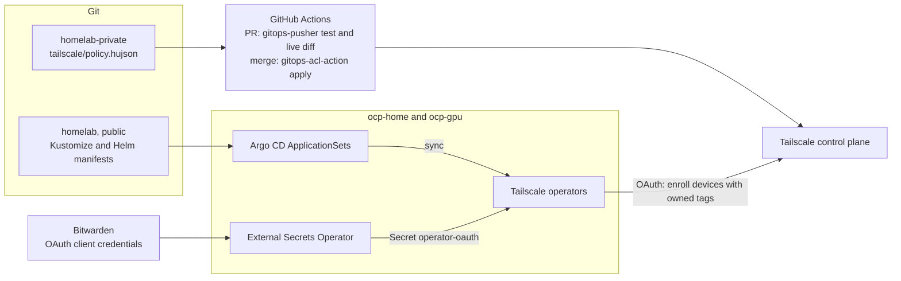
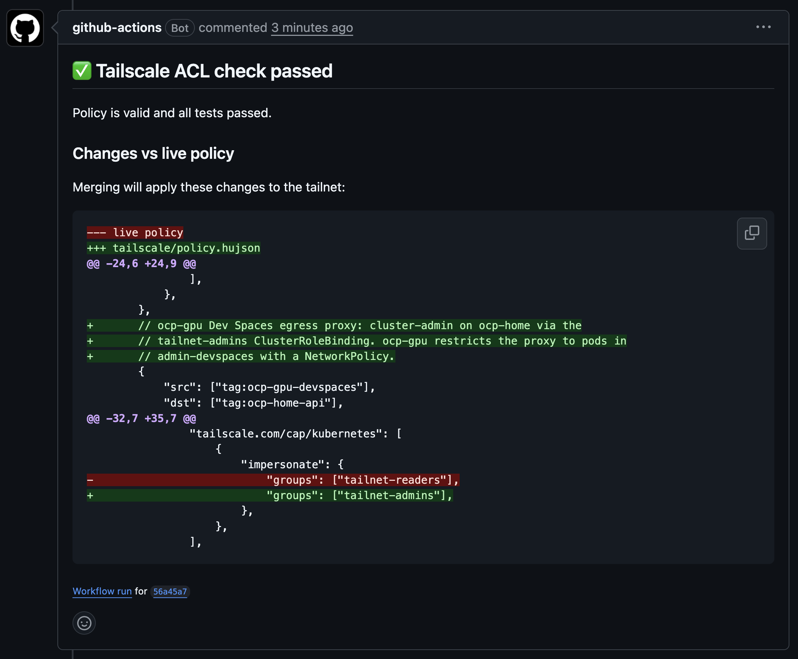

# Tailscale: login-free `ocp-home` access from `ocp-gpu` Dev Spaces

Every OpenShift Dev Spaces workspace on `ocp-gpu` starts with a working `kubectl`/`oc` context for the `ocp-home` cluster. There's no `oc login`, no token, and no credential stored in the workspace. Identity comes from Tailscale, and authorization is defined in the tailnet policy and Kubernetes RBAC.

Everything is deployed as code:
- Argo CD deploys the Tailscale Kubernetes operator to both clusters from this repository.
- The tailnet policy is version-controlled and applied by GitHub Actions.
- OAuth client credentials come from Bitwarden through External Secrets.

## Contents

- [The problem](#the-problem)
- [Architecture](#architecture)
- [Request flow](#request-flow)
- [How it is deployed](#how-it-is-deployed)
- [Why this approach](#why-this-approach)
- [Security model](#security-model)
- [Setup and verification](#setup-and-verification)
- [Lessons learned](#lessons-learned)
- [Future improvements](#future-improvements)
- [File map](#file-map)

## The problem

Dev Spaces automatically logs a workspace into the cluster it runs on (`ocp-gpu`), but not into any other cluster. Reaching `ocp-home` from a workspace used to take this every time:

1. Open the `ocp-home` web console and log in.
2. Choose **Copy login command** from the user menu, log in again, and choose **Display token**.
3. Paste the command into the workspace terminal:

   ```bash
   oc login --token=sha256~<token> --server=https://api.ocp-home.rh-lab.morey.tech:6443
   ```

This had three problems:

- **It didn't persist.** The workspace home directory isn't on a persistent volume, so the login was lost whenever the workspace restarted. Each new workspace also needed its own login.
- **It expired.** OpenShift OAuth tokens last 24 hours by default.
- **It spread a bearer token around.** The token ended up in `~/.kube/config` and shell history. Anyone who got hold of it could use the `ocp-home` API from anywhere that could reach it.

Now, a workspace needs nothing beyond having started:

```bash
oc get pods -A                               # ocp-gpu: the local cluster (default context)
oc --context=ocp-home-tailnet get pods -A    # ocp-home: through Tailscale
```

## Architecture



| Component | Cluster | Role | Source |
|---|---|---|---|
| Tailscale operator with API server proxy | `ocp-home` | Joins the tailnet as `ocp-home-api`. Serves HTTPS on port 443 with a Tailscale-issued certificate, identifies each caller by its tailnet identity, and forwards requests to the kube-apiserver as that identity (`apiServerProxyConfig.mode: "true"`) | [kustomization.yaml](../../kubernetes/ocp-home/system/tailscale/kustomization.yaml) |
| `tailnet-readers` → `view` | `ocp-home` | Read-only access for all tailnet users and tagged devices | [tailnet-readers.yaml](../../kubernetes/ocp-home/system/tailscale/tailnet-readers.yaml) |
| `tailnet-admins` → `cluster-admin` | `ocp-home` | Admin access, granted in the tailnet policy only to the Dev Spaces egress device | [tailnet-admins.yaml](../../kubernetes/ocp-home/system/tailscale/tailnet-admins.yaml) |
| Tailscale operator | `ocp-gpu` | API server proxy and ingress off; only manages egress proxies | [kustomization.yaml](../../kubernetes/ocp-gpu/system/tailscale/kustomization.yaml) |
| Egress Service `ocp-home-api` | `ocp-gpu` | `tailscale.com/tailnet-fqdn: ocp-home-api.taile3c3a8.ts.net` makes the operator run an egress proxy pod, tailnet device `ocp-gpu-devspaces`. It gives `ocp-home`'s endpoint an in-cluster DNS name | [ocp-home-api.yaml](../../kubernetes/ocp-gpu/system/tailscale/ocp-home-api.yaml) |
| ProxyClass and SCC binding | `ocp-gpu` | Runs the kernel-mode proxy as root, with the `privileged` SCC granted only to the `proxies` service account | [proxyclass.yaml](../../kubernetes/ocp-gpu/system/tailscale/proxyclass.yaml), [proxy-scc.yaml](../../kubernetes/ocp-gpu/system/tailscale/proxy-scc.yaml) |
| NetworkPolicy | `ocp-gpu` | Only workspace pods in `admin-devspaces` can reach the proxy on TCP 443 | [networkpolicy.yaml](../../kubernetes/ocp-gpu/system/tailscale/networkpolicy.yaml) |
| ValidatingAdmissionPolicy | `ocp-gpu` | Rejects Services with Tailscale metadata outside `tailscale-system`, so users can't request their own tailnet proxies | [service-admission-policy.yaml](../../kubernetes/ocp-gpu/system/tailscale/service-admission-policy.yaml) |
| Workspace kubeconfig | `ocp-gpu` | Credential-free kubeconfig that Dev Spaces mounts into every workspace at `/etc/ocp-home/kubeconfig` | [ocp-home-kubeconfig.yaml](../../kubernetes/ocp-gpu/system/openshift-devspaces/ocp-home-kubeconfig.yaml) |
| Shell init snippet | image | Adds the mounted kubeconfig to `KUBECONFIG` in workspace shells | [ocp-home-kubeconfig.sh](../../containers/devspace-homelab/ocp-home-kubeconfig.sh) |
| Tailnet policy | tailnet | Tag ownership, grants, Kubernetes capability mapping, and ACL tests | Private repo, [excerpt below](#tailnet-policy) |

## Request flow



The workspace kubeconfig gives the in-cluster Service as the server and the real tailnet hostname for TLS:

```yaml
clusters:
  - name: ocp-home-tailnet
    cluster:
      server: https://ocp-home-api.tailscale-system.svc.cluster.local
      tls-server-name: ocp-home-api.taile3c3a8.ts.net
users:
  - name: devspaces-tailnet
    user: {}          # no token, certificate, or exec plugin
```

- **TLS runs end to end.** It goes from the `oc` client to the `ocp-home` operator; the egress proxy only forwards TCP. Setting `tls-server-name` gives the right SNI and certificate check without cluster-wide MagicDNS or an HTTP proxy.
- **No credentials anywhere in the workspace.** The API server proxy sees the connection come from the tailnet device `ocp-gpu-devspaces` (tag `tag:ocp-gpu-devspaces`). It sets `Impersonate-User` to that device's FQDN and `Impersonate-Group` to the groups the tailnet policy grants.
- **OpenShift RBAC does the rest.** `ocp-home` authorizes the request as the impersonated user and groups:

```console
$ oc --context=ocp-home-tailnet auth whoami
ATTRIBUTE   VALUE
Username    ocp-gpu-devspaces.taile3c3a8.ts.net
Groups      [tailnet-readers tailnet-admins system:authenticated]
```

## How it is deployed



- **Kubernetes resources:** each cluster's `system` ApplicationSet discovers `kubernetes/<cluster>/system/tailscale/` and creates the `tailscale-system` Application. Kustomize renders the pinned `tailscale-operator` Helm chart (1.102.4) plus the supporting manifests, and the ApplicationSet enables server-side apply for the Tailscale Applications.
- **Credentials:** each operator has its own OAuth client, with Devices Core, Auth Keys, and Services write scopes, restricted to its operator tag. An `ExternalSecret` syncs the client ID and secret from Bitwarden into `tailscale-system/operator-oauth`. Nothing sensitive is in Git or Helm values.
- **Tailnet policy:** stored in a private repository and managed as code. The admin console isn't used for policy edits.
  - **On a pull request,** the workflow runs `gitops-pusher test`, which checks the syntax and runs the policy's ACL tests. It also fetches the live policy from the Tailscale API, and posts the test result, including any failure output, and the diff as a PR comment.
  - **On merge to `main`,** `tailscale/gitops-acl-action` applies the policy.
  - **Why the PR check doesn't use the action:** `tailscale/gitops-acl-action` exposes no step outputs, so its results only appear in the job log. The PR check therefore runs the same pinned `gitops-pusher` commit directly. [tailscale/gitops-acl-action#84](https://github.com/tailscale/gitops-acl-action/issues/84) proposes adding outputs so the action can be used here too.

  The PR comment on the change that granted `tailnet-admins`:

  

### Tailnet policy

The parts relevant to this integration:

```hujson
"grants": [
    // User-owned devices reach everything; tagged devices get only explicit grants.
    {"src": ["autogroup:member"], "dst": ["*"], "ip": ["*"]},
    // Any tailnet user or tagged device: read-only on ocp-home.
    {
        "src": ["autogroup:member", "autogroup:tagged"],
        "dst": ["tag:ocp-home-api"],
        "ip":  ["tcp:443"],
        "app": {"tailscale.com/cap/kubernetes": [{"impersonate": {"groups": ["tailnet-readers"]}}]},
    },
    // ocp-gpu Dev Spaces egress proxy: cluster-admin on ocp-home.
    {
        "src": ["tag:ocp-gpu-devspaces"],
        "dst": ["tag:ocp-home-api"],
        "ip":  ["tcp:443"],
        "app": {"tailscale.com/cap/kubernetes": [{"impersonate": {"groups": ["tailnet-admins"]}}]},
    },
],
"tagOwners": {
    "tag:ocp-home-api":      ["autogroup:admin"],
    "tag:ocp-home-proxy":    ["tag:ocp-home-api"],
    "tag:ocp-gpu-operator":  ["autogroup:admin"],
    "tag:ocp-gpu-devspaces": ["tag:ocp-gpu-operator"],
},
"tests": [
    {"src": "tag:ocp-gpu-devspaces", "proto": "tcp", "accept": ["tag:ocp-home-api:443"]},
    {"src": "tag:ocp-gpu-devspaces", "proto": "tcp", "deny":   ["tag:ocp-gpu-operator:22", "tag:ocp-home-proxy:443"]},
],
```

Each operator's OAuth client is limited to its own tag. Tag ownership then limits which tags each operator can give the devices it creates.

## Why this approach

| Option | Result |
|---|---|
| Keep pasting `oc login` tokens | Manual on every workspace start, expires daily, and leaves a bearer token in the workspace |
| Long-lived ServiceAccount token for `ocp-home`, synced from Bitwarden into workspaces | Automatic, but it's a static admin credential that has to be rotated and protected, and it works from anywhere that can reach the API if leaked |
| Federate `ocp-gpu` identities into `ocp-home`'s OAuth or OIDC | Heavier setup on both clusters. Still token-based, and it only helps Dev Spaces, not the rest of the tailnet |
| Run `tailscaled` inside every workspace | Each workspace start would enroll a new device and need an auth key in the workspace or a browser login. Workspaces are unprivileged and short-lived; `admin-devspaces` alone has 21 of them |
| **Chosen: operator API server proxy on `ocp-home`, and one operator-managed egress proxy on `ocp-gpu`** | No credentials in workspaces or Git, one stable tailnet device, access defined in the tailnet policy, and no changes to workspace images or devfiles |

What this gets:

- **Identity instead of secrets.** Access is decided by which tailnet device the traffic comes from. Tailscale enforces that cryptographically with WireGuard node keys, not with a token that can be copied.
- **One place to control access.** Tailnet grants decide who can reach the API and which Kubernetes groups they get; RBAC decides what those groups can do. Revoking access is a policy change or a device removal, not a token hunt.
- **Useful beyond Dev Spaces.** The same `ocp-home` endpoint gives every tailnet user token-free read-only access:

  ```bash
  tailscale configure kubeconfig ocp-home-api
  ```

- **Nothing to set up in workspaces.** No Tailscale client, auth key, or login inside the workspace, which fits short-lived, unprivileged containers.
- **Reproducible and reviewable.** Kubernetes resources, the tailnet policy, and its tests all change through Git. Policy changes show a live diff before they are merged.

## Security model

Access is controlled in layers, each defined in code:

| Layer | Control | Where |
|---|---|---|
| Tailnet policy | Only `tag:ocp-gpu-devspaces` gets `tailnet-admins`; everything else tagged gets at most `tailnet-readers`. ACL tests confirm the proxy can reach only what it should | Private tailnet policy |
| Tag ownership | Each operator can create devices only with the tags it owns | Private tailnet policy, OAuth client tag restrictions |
| `ocp-home` RBAC | Admin access requires the `tailnet-admins` group; tailnet identity alone gives only `view` | [tailnet-admins.yaml](../../kubernetes/ocp-home/system/tailscale/tailnet-admins.yaml), [tailnet-readers.yaml](../../kubernetes/ocp-home/system/tailscale/tailnet-readers.yaml) |
| `ocp-gpu` NetworkPolicy | Only DevWorkspace pods in `admin-devspaces` can reach the proxy on TCP 443. It matches `kubernetes.io/metadata.name`, which namespace owners can't change | [networkpolicy.yaml](../../kubernetes/ocp-gpu/system/tailscale/networkpolicy.yaml) |
| `ocp-gpu` admission | Services with `tailscale.com/*` metadata or `loadBalancerClass: tailscale` are rejected outside `tailscale-system` | [service-admission-policy.yaml](../../kubernetes/ocp-gpu/system/tailscale/service-admission-policy.yaml) |
| OpenShift SCC | `privileged` is granted only to the proxy service account; the operator runs non-root with all capabilities dropped | [proxy-scc.yaml](../../kubernetes/ocp-gpu/system/tailscale/proxy-scc.yaml) |
| Secrets | OAuth credentials come only from Bitwarden through External Secrets; device state stays in `tailscale-system` Secrets | `operator-oauth.yaml` in each cluster |

Known trade-offs:

- **Shared identity.** Everyone using the proxy appears to `ocp-home` as `ocp-gpu-devspaces.taile3c3a8.ts.net`. Audit logs identify the proxy, not the person.
- **Effective admin boundary.** Anyone who can run pods in `admin-devspaces`, or read Secrets and exec into pods in `ocp-gpu`'s `tailscale-system`, effectively has `cluster-admin` on ocp-home.
- **Privileged, single replica.** The egress proxy is one privileged pod; a restart briefly interrupts access.

## Setup and verification

One-time tailnet setup:

1. Turn on MagicDNS and HTTPS certificates in the [DNS settings](https://login.tailscale.com/admin/dns).
2. Add the tags, grants, and tests shown [above](#tailnet-policy) to the tailnet policy through its repository.
3. Create one [OAuth client](https://login.tailscale.com/admin/settings/oauth) per operator, with **Devices Core**, **Auth Keys**, and **Services** write scopes:
   - `ocp-home`: restricted to `tag:ocp-home-api`
   - `ocp-gpu`: restricted to `tag:ocp-gpu-operator`
4. Store each client in Bitwarden as a Login item, with the client ID as the username and the secret as the password. Each cluster's `operator-oauth.yaml` references its item.

Deploy by pushing to `main` and syncing the `tailscale-system` Application on each cluster, and `openshift-devspaces-system` on ocp-gpu. Then check from a restarted workspace:

```bash
oc config get-contexts                                   # logged-user (default) and ocp-home-tailnet
oc --context=ocp-home-tailnet config view --minify       # user entry is {}
oc --context=ocp-home-tailnet auth whoami                # device FQDN, tailnet-admins
oc --context=ocp-home-tailnet auth can-i '*' '*' -A      # yes
oc --context=ocp-home-tailnet get nodes
```

The per-cluster guides have the detailed rollout, validation, troubleshooting, and rollback steps:

- [`ocp-home` API server proxy](../../kubernetes/ocp-home/system/tailscale/README.md)
- [`ocp-gpu` egress proxy](../../kubernetes/ocp-gpu/system/tailscale/README.md)
- [Dev Spaces workspace usage](../../kubernetes/ocp-gpu/system/openshift-devspaces/TAILSCALE.md)

## Lessons learned

| Problem | Symptom | Fix |
|---|---|---|
| The operator image expects to run as root, with a writable home directory | Under OpenShift's random non-root UID, `HOME` resolved to `/`, so tsnet tried to create `/.config` and the operator crashed at startup | `XDG_CONFIG_HOME=/tmp/tailscale` gives tsnet a writable config directory; device state stays in the Kubernetes Secret |
| External Secrets fills in defaults | Argo CD showed the `ExternalSecret` as permanently OutOfSync | Declare `conversionStrategy`, `decodingStrategy`, and `metadataPolicy` explicitly |
| The operator rewrites the egress Service's `spec.externalName` | Argo CD kept reverting it | `ignoreDifferences` on that one field, plus `RespectIgnoreDifferences=true` |
| Kernel-mode egress proxies are privileged, including the `sysctler` init container | OpenShift's default restricted SCC would reject the proxy pods | Bind the `privileged` SCC to the `proxies` service account only; the operator stays restricted |
| Dev Spaces kubeconfig injection treats `KUBECONFIG` as one directory | Setting a multi-path `KUBECONFIG` on the container made the dashboard write the user's credentials to `~/.kube/config:/etc/ocp-home/kubeconfig/config`, so `oc` fell back to the pod service account | Set `KUBECONFIG` in shell init instead. Reported upstream as [eclipse-che/che#23972](https://github.com/eclipse-che/che/issues/23972) |
| The operator acts on Tailscale annotations on any Service, in any namespace | Any namespace owner could request a tailnet device with an operator-owned tag | ValidatingAdmissionPolicy limiting such Services to `tailscale-system` |
| The tailnet's default allow-all grant | Tagged infrastructure devices could reach every machine | Limit the allow-all grant to `autogroup:member` and add deny tests for the proxy tag |
| `tailscale/gitops-acl-action` has no step outputs | ACL test failures and policy changes were only visible in the job log, not on the PR | Run the same pinned `gitops-pusher` directly for PR checks, diff against the live policy, and post both as a PR comment. Requested outputs upstream in [tailscale/gitops-acl-action#84](https://github.com/tailscale/gitops-acl-action/issues/84) |

## Future improvements

- **Per-user identity.** Give each Dev Spaces user their own egress proxy and tag (for example, one per workspace namespace), or map users to Tailscale identities. Audit logs would then name the person, and `cluster-admin` could go to specific people instead of a shared device.
- **Least privilege and just-in-time access.** Replace the standing `cluster-admin` grant with narrower roles, plus time-limited elevation for admin tasks.
- **Session recording.** Deploy the operator's `Recorder` and require recording for `kubectl exec` sessions through the API server proxy.
- **High availability.** Move the egress proxy to a multi-replica `ProxyGroup`, and look at whether an unprivileged proxy mode can avoid the `privileged` SCC. This wasn't done here because both clusters are single-node OpenShift (SNO), so extra replicas would share the same node and wouldn't add availability. It becomes worthwhile on multi-node clusters.
- **Narrower read access.** Replace the broad `autogroup:tagged` → `tailnet-readers` grant with explicit tags.
- **Manage the remaining setup as code.** Handle DNS and HTTPS settings and the OAuth clients with the Tailscale Terraform provider, so a new tailnet can be built from code.
- **Use the upstream action for PR checks.** If [tailscale/gitops-acl-action#84](https://github.com/tailscale/gitops-acl-action/issues/84) lands, replace the hand-rolled `gitops-pusher` steps with the action's outputs, and keep getting its updates.
- **More clusters.** Expose `ocp-mgmt` and `ocp-lab` the same way, and ship one multi-context kubeconfig to workspaces.
- **Continuous verification.** Add a scheduled check that runs `auth whoami` and `can-i` through the proxy and alerts when access breaks or grows unexpectedly.

## File map

```text
kubernetes/
├── ocp-home/
│   ├── openshift-gitops-config/system-appset.yaml   # ServerSideApply for the tailscale app
│   └── system/tailscale/
│       ├── kustomization.yaml                       # operator chart, API server proxy in auth mode
│       ├── operator-oauth.yaml                      # OAuth client from Bitwarden
│       ├── tailnet-readers.yaml                     # tailnet-readers → view
│       ├── tailnet-admins.yaml                      # tailnet-admins → cluster-admin
│       └── README.md
└── ocp-gpu/
    ├── openshift-gitops-config/system-appset.yaml   # ServerSideApply, externalName ignoreDifferences
    └── system/
        ├── tailscale/
        │   ├── kustomization.yaml                   # operator chart, egress only
        │   ├── operator-oauth.yaml                  # OAuth client from Bitwarden
        │   ├── ocp-home-api.yaml                    # egress Service to ocp-home-api.taile3c3a8.ts.net
        │   ├── proxyclass.yaml                      # kernel-mode proxy settings
        │   ├── proxy-scc.yaml                       # privileged SCC for proxies only
        │   ├── networkpolicy.yaml                   # admin-devspaces only
        │   ├── service-admission-policy.yaml        # Tailscale Services only in tailscale-system
        │   └── README.md
        └── openshift-devspaces/
            ├── ocp-home-kubeconfig.yaml             # credential-free kubeconfig mounted in workspaces
            └── TAILSCALE.md
containers/devspace-homelab/
├── ocp-home-kubeconfig.sh                           # adds the kubeconfig to KUBECONFIG in shells
└── Containerfile
```
