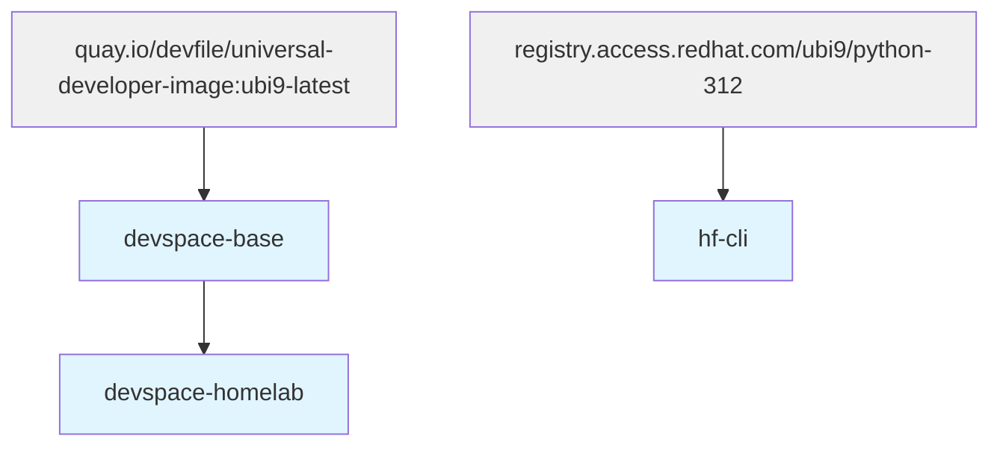
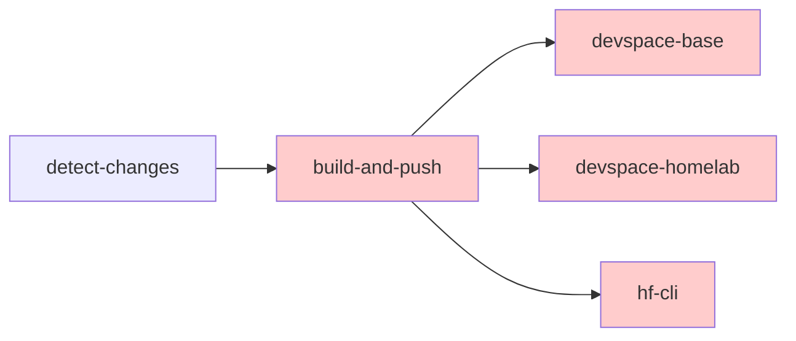
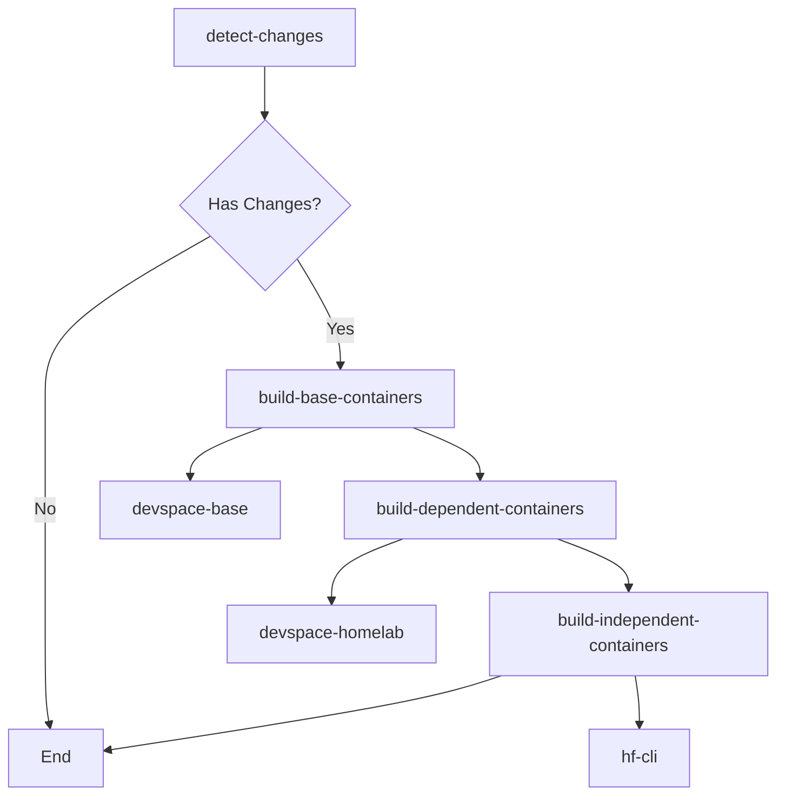

# Container Build Dependency Resolution - Implementation Plan

**Issue**: [#132 - Container build dependency: devspace-homelab requires newly built devspace-base](https://github.com/morey-tech/homelab/issues/132)

**Date**: 2026-01-24

## Problem Statement

When modifying both a parent container (devspace-base) and its dependent child container (devspace-homelab) in the same PR, the CI build fails because:

1. Both containers are detected as changed
2. CI builds all containers in parallel (no ordering)
3. devspace-homelab's `FROM` statement references the new devspace-base image
4. Build fails - new devspace-base image not yet pushed to registry

## Current State Analysis

### Container Inventory and Dependencies



**Dependency Mapping**:
- `devspace-base`: Independent (extends external base)
- `devspace-homelab`: Depends on `devspace-base`
- `hf-cli`: Independent (extends external base)

### Current Workflow Architecture

**File**: [`/.github/workflows/container-build.yml`](/.github/workflows/container-build.yml)



**Issues**:
- All containers build in parallel (matrix strategy)
- No dependency awareness
- Fails when parent-child modified together

## Solution Design

### Option A: Sequential Build Stages (Recommended)

Implement a multi-stage build workflow that respects container dependencies.



### Implementation Strategy

#### 1. Auto-Detection with Naming Convention

Define container categories using automatic detection based on naming patterns:

```yaml
env:
  REGISTRY: ghcr.io
  # Container dependency groups determined by naming convention:
  # - Base containers: end with "-base" (e.g., devspace-base)
  # - Dependent containers: explicitly listed below
  # - Independent containers: all others
  DEPENDENT_CONTAINERS: '["devspace-homelab"]'
```

**Detection Logic**:
```bash
# Base containers: auto-detect any container ending in "-base"
base_containers=$(echo "$all_containers" | jq -r '.[] | select(endswith("-base"))')

# Dependent containers: match against explicit list
dependent_containers=$(echo "$all_containers" | jq -r --argjson deps "$DEPENDENT_CONTAINERS" \
  '.[] | select(. as $c | $deps | index($c))')

# Independent containers: all others
independent_containers=$(echo "$all_containers" | jq -r --argjson deps "$DEPENDENT_CONTAINERS" \
  '.[] | select(endswith("-base") | not) | select(. as $c | $deps | index($c) | not)')
```

**Rationale**:
- Simple naming convention: any container ending in `-base` is automatically treated as a base
- Self-documenting: name indicates purpose
- Scales automatically: adding `foo-base` automatically creates new base container
- Only dependent containers need explicit listing
- No complex parsing logic needed

#### 2. Enhanced Change Detection

Modify [`detect-changes`](/.github/workflows/container-build.yml:30-81) job to categorize changed containers:

```yaml
jobs:
  detect-changes:
    outputs:
      base_containers: ${{ steps.categorize.outputs.base_containers }}
      dependent_containers: ${{ steps.categorize.outputs.dependent_containers }}
      independent_containers: ${{ steps.categorize.outputs.independent_containers }}
      has_base: ${{ steps.categorize.outputs.has_base }}
      has_dependent: ${{ steps.categorize.outputs.has_dependent }}
      has_independent: ${{ steps.categorize.outputs.has_independent }}
```

**Logic**:
- Detect all changed containers (existing logic)
- Filter into base/dependent/independent categories
- Output separate JSON arrays for each category
- Set boolean flags for conditional job execution

#### 3. Three-Stage Build Process

**Stage 1: Build Base Containers**
```yaml
build-base-containers:
  needs: detect-changes
  if: needs.detect-changes.outputs.has_base == 'true'
  strategy:
    matrix:
      container: ${{ fromJson(needs.detect-changes.outputs.base_containers) }}
```

**Stage 2: Build Dependent Containers**
```yaml
build-dependent-containers:
  needs: [detect-changes, build-base-containers]
  if: |
    always() && 
    needs.detect-changes.outputs.has_dependent == 'true' &&
    (needs.build-base-containers.result == 'success' || needs.build-base-containers.result == 'skipped')
  strategy:
    matrix:
      container: ${{ fromJson(needs.detect-changes.outputs.dependent_containers) }}
```

**Stage 3: Build Independent Containers** (Parallel with Stage 1)
```yaml
build-independent-containers:
  needs: detect-changes
  if: needs.detect-changes.outputs.has_independent == 'true'
  strategy:
    matrix:
      container: ${{ fromJson(needs.detect-changes.outputs.independent_containers) }}
```

#### 4. Shared Build Logic

Extract common build steps into reusable template to avoid duplication:

- Checkout repository
- Free disk space
- Set up QEMU
- Set up Docker Buildx
- Log in to GHCR
- Extract metadata
- Build and push image

## Implementation Steps

### Phase 1: Workflow Restructure

1. **Add dependency mapping to env vars**
   - Define DEPENDENT_CONTAINERS (explicit list)
   - Base containers auto-detected by `-base` suffix

2. **Update detect-changes job**
   - Add categorization logic with auto-detection
   - Filter base containers: any ending in `-base`
   - Filter dependent containers: match against DEPENDENT_CONTAINERS list
   - Filter independent containers: all others not in base or dependent
   - Output separate arrays and flags for each category

3. **Split build-and-push into three jobs**
   - `build-base-containers` (auto-detected via naming)
   - `build-dependent-containers` (depends on base)
   - `build-independent-containers` (parallel with base)

4. **Configure job dependencies**
   - Independent runs parallel with base
   - Dependent waits for base to complete
   - Use `always()` with result checks for proper conditional execution

### Phase 2: Testing Strategy

1. **Test Case 1: Base Container Only**
   - Modify only [`containers/devspace-base/Containerfile`](containers/devspace-base/Containerfile)
   - Expected: Only base stage runs

2. **Test Case 2: Dependent Container Only**
   - Modify only [`containers/devspace-homelab/Containerfile`](containers/devspace-homelab/Containerfile)
   - Expected: Only dependent stage runs (base skipped)

3. **Test Case 3: Both Containers** (Primary Use Case)
   - Modify both devspace-base and devspace-homelab
   - Expected: Base builds first, then dependent builds successfully

4. **Test Case 4: Independent Container**
   - Modify only [`containers/hf-cli/Containerfile`](containers/hf-cli/Containerfile)
   - Expected: Independent stage runs in parallel

5. **Test Case 5: All Containers**
   - Modify all three containers
   - Expected: Base + Independent parallel, then Dependent

6. **Test Case 6: Workflow Dispatch**
   - Manual trigger with specific container
   - Manual trigger with all containers

### Phase 3: Documentation Updates

1. **Update [`containers/README.md`](containers/README.md)**
   - Document dependency structure
   - Explain build ordering
   - Provide guidelines for adding new containers

2. **Add inline workflow comments**
   - Explain dependency logic
   - Document why stages are structured this way

## Workflow Changes Diagram

**Current (Single Stage)**:
```
[detect-changes] → [build-and-push (matrix: all containers in parallel)]
                    ├─ devspace-base
                    ├─ devspace-homelab ❌ FAILS
                    └─ hf-cli
```

**Proposed (Three Stages)**:
```
[detect-changes] → [build-base-containers (matrix: base)]
                   ├─ devspace-base ✅
                   │
                   └─→ [build-dependent-containers (matrix: dependent)]
                       └─ devspace-homelab ✅
                       
                 → [build-independent-containers (matrix: independent)]
                   └─ hf-cli ✅ (runs parallel with base)
```

## Benefits

### Immediate Benefits

1. **Single PR Workflow**: Modify parent + child containers in one PR
2. **Automatic Ordering**: CI enforces build dependencies
3. **No Manual Coordination**: Eliminates two-PR workaround
4. **Fast Builds**: Independent containers still build in parallel

### Long-term Benefits

1. **Extensible**: Easy to add new containers to any category
2. **Explicit Dependencies**: Documented in workflow env vars
3. **Predictable Behavior**: Clear build order for all scenarios
4. **Maintainable**: Simple hardcoded mapping, no complex parsing

## Alternative Approaches Considered

### Option B: Metadata in Containerfiles

```dockerfile
# DEPENDS_ON: devspace-base
FROM ghcr.io/morey-tech/homelab/devspace-base:latest
```

**Rejected Because**:
- Requires parsing Containerfiles in workflow
- Adds complexity for marginal benefit
- Harder to maintain and debug
- Current dependency structure is simple enough for hardcoding

### Option C: Separate Workflows

- `base-containers-build.yml`
- `dependent-containers-build.yml`

**Rejected Because**:
- Multiple workflow files harder to maintain
- Adds complexity without benefit
- Single workflow provides better overview

## Success Criteria

- [ ] Can modify both devspace-base and devspace-homelab in single PR
- [ ] devspace-homelab builds successfully after devspace-base completes
- [ ] Independent containers still build in parallel
- [ ] Workflow_dispatch works for selective builds
- [ ] All six test cases pass
- [ ] Build time not significantly increased for independent changes
- [ ] Clear error messages if builds fail

## Risk Assessment

### Low Risk
- Changes are isolated to workflow file
- No changes to Containerfiles or build process
- Can revert easily if issues arise
- Existing parallel behavior preserved for independent containers

### Mitigation
- Test thoroughly with all use cases before merging
- Monitor first few PRs after implementation
- Document rollback procedure if needed

## Future Enhancements

### Multi-Level Dependencies (If Needed)

If we create deeper dependency chains (e.g., base → intermediate → final):

**Naming Convention Approach**:
- Tier 1: Containers ending in `-base` (auto-detected)
- Tier 2: Containers ending in `-intermediate` (auto-detected)
- Tier 3+: Explicitly listed in DEPENDENT_CONTAINERS

```yaml
env:
  DEPENDENT_CONTAINERS: '["devspace-homelab", "devspace-advanced"]'
  # Auto-detected via naming:
  # - *-base → Stage 1 (base containers)
  # - *-intermediate → Stage 2 (intermediate containers)
  # - Listed above → Stage 3 (dependent containers)
  # - All others → Independent (parallel with Stage 1)
```

Detection logic automatically identifies:
- `*-base` → Stage 1
- `*-intermediate` → Stage 2
- Listed in DEPENDENT_CONTAINERS → Stage 3
- All others → Independent (parallel)

Add another build stage:

```yaml
build-intermediate-containers:
  needs: [detect-changes, build-base-containers]
  if: needs.detect-changes.outputs.has_intermediate == 'true'
  
build-dependent-containers:
  needs: [detect-changes, build-intermediate-containers]
  if: needs.detect-changes.outputs.has_dependent == 'true'
```

This maintains the naming convention pattern and allows for extensibility without editing workflow logic.

### Dynamic Dependency Detection

For complex projects with many containers, consider:

1. **Dependency file**: `containers/dependencies.yaml`
```yaml
dependencies:
  devspace-homelab:
    depends_on:
      - devspace-base
  hf-cli:
    depends_on: []
```

2. **Workflow parses file** to build dependency graph
3. **Generates build order** dynamically

**Not needed now** - current 3-container setup works fine with hardcoded mapping.

## References

- Issue: [#132 - Container build dependency](https://github.com/morey-tech/homelab/issues/132)
- Related PRs:
  - [#128 - Create base devspace image](https://github.com/morey-tech/homelab/pull/128)
  - [#130 - Rename devcontainer to devspace-homelab](https://github.com/morey-tech/homelab/pull/130)
  - [#131 - Automate GitHub CLI authentication](https://github.com/morey-tech/homelab/pull/131)
  - [#133 - Add GitHub CLI auto-authentication to devspace-base](https://github.com/morey-tech/homelab/pull/133)
  - [#134 - Enable gh-auth auto-authentication in devspace-homelab](https://github.com/morey-tech/homelab/pull/134)

## Implementation Checklist

- [ ] Modify `.github/workflows/container-build.yml`
  - [ ] Add dependency mapping env vars
  - [ ] Update detect-changes job with categorization
  - [ ] Create build-base-containers job
  - [ ] Create build-dependent-containers job
  - [ ] Create build-independent-containers job
  - [ ] Configure job dependencies and conditionals
- [ ] Create test PR with both containers modified
- [ ] Validate all six test scenarios
- [ ] Update `containers/README.md` with dependency documentation
- [ ] Add inline comments to workflow
- [ ] Close issue #132

## Next Steps

1. Review this plan with stakeholders
2. Get approval for implementation approach
3. Switch to Code mode to implement workflow changes
4. Create test PR to validate solution
5. Document learnings in AGENTS.md
