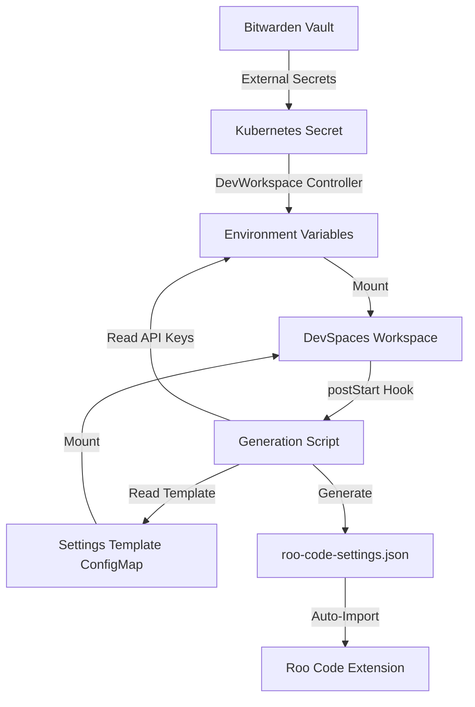
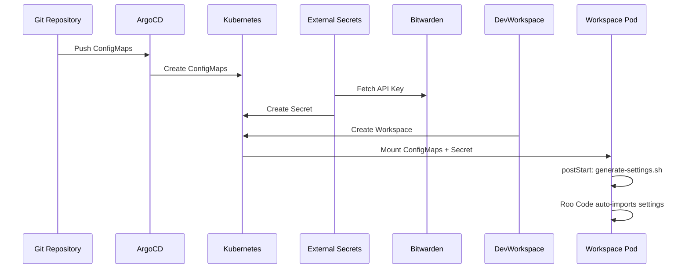
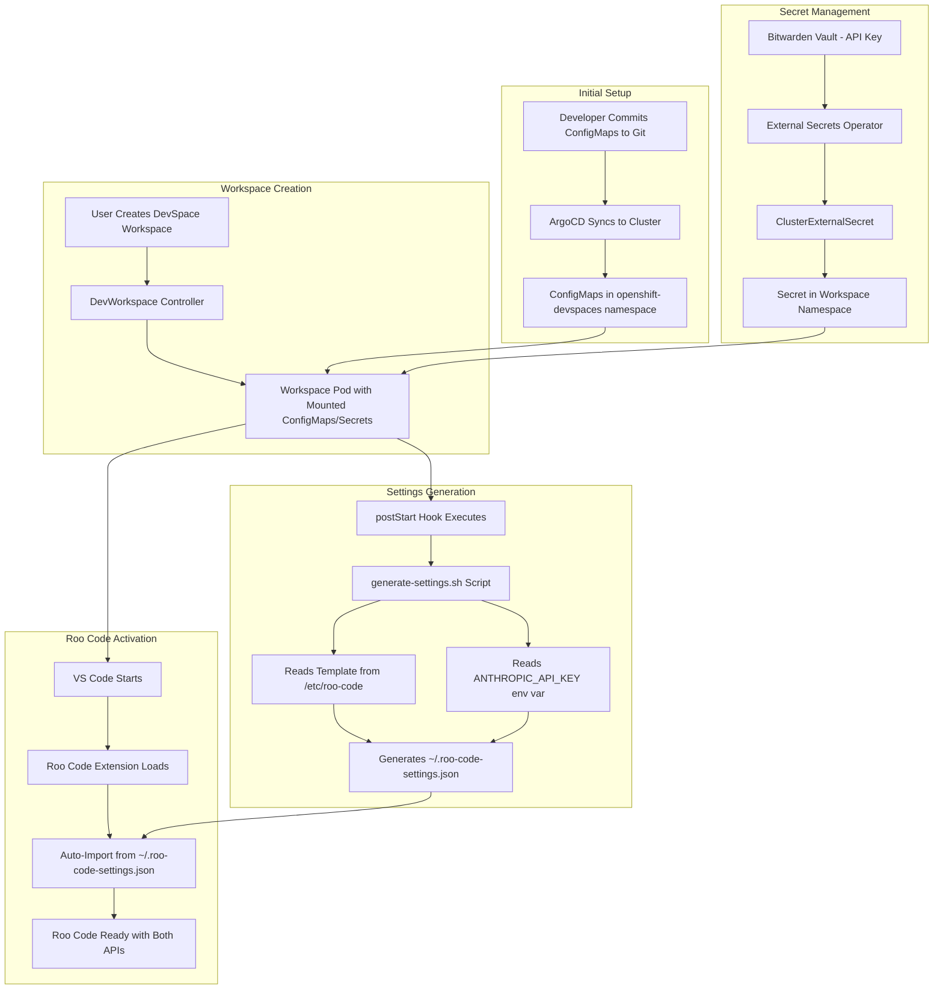

# Roo Code Auto-Configuration Plan

## Overview

Automate Roo Code configuration in OpenShift DevSpaces to provide pre-configured API provider profiles for:
1. **Anthropic API** - Using existing `ANTHROPIC_API_KEY` from Kubernetes secret
2. **Local Inference Server** - vLLM-based LLM running on ocp-gpu cluster

This eliminates manual configuration steps and ensures consistent setup across all DevSpaces workspaces.

## Background

### Current State
- **Claude Code extension** already auto-configured with `ANTHROPIC_API_KEY` environment variable
- **Roo Code extension** requires manual configuration via GUI or import
- API keys stored in Bitwarden, synced via External Secrets Operator to workspace namespaces
- DevSpaces uses che-code editor with VS Code extension compatibility

### Roo Code Settings Management
Based on [Roo Code Settings Documentation](https://docs.roocode.com/features/settings-management/):

- **Export/Import**: Settings can be exported to JSON and imported back
- **Auto-Import**: `roo-cline.autoImportSettingsPath` VS Code setting enables automatic import on startup
- **Security Warning**: Exported JSON contains API keys in plaintext
- **Schema**: Includes API Provider Profiles and Global Settings

### Key Resources
- **Anthropic Secret**: `kubernetes/ocp-gpu/system/openshift-devspaces/claude-code-api-key.yaml`
  - ClusterExternalSecret distributes to all workspace namespaces
  - Mounted as `ANTHROPIC_API_KEY` environment variable
- **Inference Server**: `kubernetes/ocp-gpu/applications/inference-server`
  - vLLM serving RedHatAI models
  - OpenAI-compatible API endpoint
  - Route: `https://inference-server.apps.ocp-gpu.rh-lab.morey.tech` (needs verification)

## Architecture Decision

### Option A: Static Settings in Git (Simplest)
**Approach**: Manually export settings once, store in git, auto-import on workspace start

**Pros**:
- Simple implementation
- No dynamic generation logic
- Easy to version control and update

**Cons**:
- API keys in plaintext in git (security risk)
- Requires manual update when keys rotate
- Same API key for all users

### Option B: Dynamic Generation from Environment Variables (Secure)
**Approach**: Generate settings JSON at workspace startup from environment variables

**Pros**:
- No plaintext secrets in git
- Automatically uses current API key from secret
- Supports future per-user API keys

**Cons**:
- More complex implementation
- Requires init script and template
- Debugging is harder

### Option C: Hybrid Approach (Recommended)
**Approach**: Store settings template in git, inject API keys from environment at runtime

**Pros**:
- Balance of simplicity and security
- Settings changes version-controlled
- API keys never committed to git
- Automatic key rotation support

**Cons**:
- Requires script to merge template + env vars
- Slight startup delay for generation

**Decision**: **Option C - Hybrid Approach**

## Implementation Design

### Architecture Flow



### Components

#### 1. Settings Template ConfigMap
**File**: `kubernetes/ocp-gpu/system/openshift-devspaces/roo-code-settings-template.yaml`

Contains settings JSON with placeholder tokens for API keys:

```yaml
apiVersion: v1
kind: ConfigMap
metadata:
  name: roo-code-settings-template
  namespace: openshift-devspaces
  labels:
    controller.devfile.io/mount-to-devworkspace: 'true'
    controller.devfile.io/watch-configmap: 'true'
  annotations:
    controller.devfile.io/mount-as: subpath
    controller.devfile.io/mount-path: /etc/roo-code
data:
  settings-template.json: |
    {
      "apiProviders": [
        {
          "id": "anthropic-api",
          "name": "Anthropic API",
          "provider": "anthropic",
          "apiKey": "{{ANTHROPIC_API_KEY}}",
          "baseUrl": "https://api.anthropic.com",
          "defaultModel": "claude-sonnet-4-5"
        },
        {
          "id": "local-llm",
          "name": "Local Inference Server",
          "provider": "openai-compatible",
          "apiKey": "not-needed",
          "baseUrl": "https://interence-server-inference-server.apps.ocp-gpu.rh-lab.morey.tech/v1",
          "defaultModel": "local-llm"
        }
      ],
      "globalSettings": {
        "uiSettings": {
          "collapseThinkingByDefault": true
        },
        "contextSettings": {
          "includeCurrentTime": false,
          "includeCurrentCost": true
        }
      }
    }
```

#### 2. Settings Generation Script ConfigMap
**File**: `kubernetes/ocp-gpu/system/openshift-devspaces/roo-code-generate-script.yaml`

Shell script to merge template with environment variables:

```yaml
apiVersion: v1
kind: ConfigMap
metadata:
  name: roo-code-generate-script
  namespace: openshift-devspaces
  labels:
    controller.devfile.io/mount-to-devworkspace: 'true'
    controller.devfile.io/watch-configmap: 'true'
  annotations:
    controller.devfile.io/mount-as: subpath
    controller.devfile.io/mount-path: /etc/roo-code
data:
  generate-settings.sh: |
    #!/bin/bash
    # Generate Roo Code settings from template and environment variables
    
    TEMPLATE_FILE="/etc/roo-code/settings-template.json"
    OUTPUT_FILE="$HOME/.roo-code-settings.json"
    
    # Check if template exists
    if [ ! -f "$TEMPLATE_FILE" ]; then
      echo "Error: Template file not found at $TEMPLATE_FILE"
      exit 1
    fi
    
    # Check if API key is available
    if [ -z "$ANTHROPIC_API_KEY" ]; then
      echo "Warning: ANTHROPIC_API_KEY not set, using placeholder"
      ANTHROPIC_API_KEY="YOUR_API_KEY_HERE"
    fi
    
    # Generate settings by replacing placeholders
    sed "s|{{ANTHROPIC_API_KEY}}|$ANTHROPIC_API_KEY|g" "$TEMPLATE_FILE" > "$OUTPUT_FILE"
    
    echo "Roo Code settings generated at $OUTPUT_FILE"
    
    # Set proper permissions
    chmod 600 "$OUTPUT_FILE"
```

#### 3. VS Code Settings for Auto-Import
**File**: `.vscode/settings.json` (in repository root)

Configure Roo Code to auto-import on startup:

```json
{
  "roo-cline.autoImportSettingsPath": "~/.roo-code-settings.json"
}
```

#### 4. Extensions Configuration
**File**: `.vscode/extensions.json` (in repository root)

Add Roo Code to auto-installed extensions:

```json
{
  "recommendations": [
    "rooveterinaryinc.roo-cline",
    "Anthropic.claude-code",
    "redhat.ansible"
  ]
}
```

#### 5. DevWorkspace DevFile Configuration
**File**: `.devfile.yaml` (in repository root)

Add postStart command to generate settings:

```yaml
schemaVersion: 2.2.0
metadata:
  name: homelab-devspace
components:
  - name: dev-tools
    container:
      image: registry.redhat.io/devspaces/udi-rhel8:latest
commands:
  - id: generate-roo-settings
    exec:
      component: dev-tools
      commandLine: |
        if [ -f /etc/roo-code/generate-settings.sh ]; then
          bash /etc/roo-code/generate-settings.sh
        fi
      workingDir: ${PROJECT_SOURCE}
events:
  postStart:
    - generate-roo-settings
```

### Deployment Flow



## Implementation Steps

### Phase 1: Configuration Files (Git)

1. **Create settings template ConfigMap**
   - Location: `kubernetes/ocp-gpu/system/openshift-devspaces/roo-code-settings-template.yaml`
   - Include both API provider profiles (Anthropic + local LLM)
   - Use `{{ANTHROPIC_API_KEY}}` placeholder token

2. **Create generation script ConfigMap**
   - Location: `kubernetes/ocp-gpu/system/openshift-devspaces/roo-code-generate-script.yaml`
   - Bash script with sed substitution
   - Error handling for missing env vars

3. **Update kustomization.yaml**
   - Add new ConfigMap resources
   - File: `kubernetes/ocp-gpu/system/openshift-devspaces/kustomization.yaml`

4. **Add Roo Code to extensions.json**
   - File: `.vscode/extensions.json`
   - Add `rooveterinaryinc.roo-cline`

5. **Configure auto-import path**
   - File: `.vscode/settings.json`
   - Add `roo-cline.autoImportSettingsPath: "~/.roo-code-settings.json"`

6. **Create devfile.yaml**
   - Location: `.devfile.yaml` (repository root)
   - Add postStart command to run generation script

### Phase 2: Validation & Testing

7. **Verify inference server route**
   ```bash
   # Check route exists
   oc get route -n inference-server inference-server
   
   # Test OpenAI-compatible endpoint
   curl -k https://inference-server.apps.ocp-gpu.rh-lab.morey.tech/v1/models
   ```

8. **Test settings generation locally**
   ```bash
   # Simulate environment
   export ANTHROPIC_API_KEY="test-key-123"
   
   # Run generation script
   bash generate-settings.sh
   
   # Verify output
   cat ~/.roo-code-settings.json | jq .
   ```

9. **Test in DevSpaces workspace**
   - Create new workspace from repository
   - Check postStart command execution
   - Verify settings file created: `ls -la ~/.roo-code-settings.json`
   - Check Roo Code extension recognizes settings
   - Test both API providers (Anthropic + local LLM)

### Phase 3: Documentation

10. **Update DevSpaces README**
    - File: `kubernetes/ocp-gpu/system/openshift-devspaces/README.md`
    - Add section: "Roo Code Auto-Configuration"
    - Document architecture and troubleshooting

11. **Create troubleshooting guide**
    - Common issues and solutions
    - Verification commands
    - Log locations

## Configuration Details

### Roo Code API Provider Profile Schema

Based on Roo Code documentation and VS Code extension patterns:

```json
{
  "apiProviders": [
    {
      "id": "unique-identifier",
      "name": "Display Name",
      "provider": "anthropic|openai|openai-compatible|ollama|openrouter|...",
      "apiKey": "actual-api-key-or-placeholder",
      "baseUrl": "https://api.endpoint.com",
      "defaultModel": "model-name"
    }
  ],
  "globalSettings": {
    "uiSettings": {
      "collapseThinkingByDefault": true|false
    },
    "contextSettings": {
      "includeCurrentTime": true|false,
      "includeCurrentCost": true|false
    },
    "approvalSettings": {
      "autoApproveReadOnly": true|false,
      "autoApproveWrite": true|false
    }
  }
}
```

### Inference Server Configuration

- **Provider Type**: `openai-compatible` (vLLM supports OpenAI API)
- **Base URL**: `https://inference-server.apps.ocp-gpu.rh-lab.morey.tech/v1`
- **API Key**: Can be any value or empty (vLLM doesn't require auth)
- **Model Name**: `local-llm` (from `SERVED_MODEL_NAME` in ConfigMap)
- **Endpoints**:
  - `/v1/models` - List available models
  - `/v1/chat/completions` - Chat completions (OpenAI-compatible)
  - `/v1/completions` - Text completions

### Security Considerations

1. **Secret Distribution**
   - ClusterExternalSecret already distributes API key to all workspace namespaces
   - DevWorkspace controller mounts as environment variable
   - No additional secret configuration needed

2. **Settings File Security**
   - Generated in user's home directory (`~/.roo-code-settings.json`)
   - Permissions set to 600 (owner read/write only)
   - Deleted when workspace is deleted

3. **API Key Exposure**
   - Settings file contains plaintext API key
   - Only accessible within workspace container
   - Not persisted outside workspace
   - Not committed to git

4. **Rotation Support**
   - When Bitwarden key updated, new workspaces get new key automatically
   - Existing workspaces need restart to pick up new secret
   - Settings regenerated on every workspace start

## Alternative Approaches Considered

### Approach: Per-User API Keys
**Description**: Each user gets their own Anthropic API key

**Pros**: Better cost tracking, rate limit isolation
**Cons**: Requires custom credential management, Bitwarden doesn't support per-user secrets easily
**Decision**: Deferred - implement shared key first, revisit if needed

### Approach: Static Settings in Secret
**Description**: Store complete settings JSON in Kubernetes Secret

**Pros**: No generation script needed
**Cons**: Still requires secret rotation mechanism, no version control of settings structure
**Decision**: Rejected - template approach provides better flexibility

### Approach: Sidecar Container
**Description**: Run sidecar container to generate settings

**Pros**: Clean separation of concerns
**Cons**: Overkill for simple script, increases resource usage
**Decision**: Rejected - postStart command sufficient

## Success Criteria

- [ ] New DevSpaces workspace automatically has Roo Code configured
- [ ] Anthropic API provider works with existing secret
- [ ] Local inference server API provider works
- [ ] Settings regenerated on workspace restart
- [ ] No manual configuration steps required
- [ ] Documentation complete and clear
- [ ] Troubleshooting guide covers common issues

## Maintenance & Operations

### Updating Settings Template
```bash
# 1. Edit template ConfigMap
vim kubernetes/ocp-gpu/system/openshift-devspaces/roo-code-settings-template.yaml

# 2. Commit and push
git add kubernetes/ocp-gpu/system/openshift-devspaces/
git commit -m "feat(devspaces): update roo-code settings template"
git push

# 3. ArgoCD syncs automatically
# New workspaces get updated settings immediately
# Existing workspaces need restart
```

### Rotating API Keys
```bash
# 1. Update in Bitwarden (via web UI)
# 2. Sync bitwarden-cli
oc exec -n external-secrets-system deployment/bitwarden-cli -- bw sync

# 3. Force secret refresh (optional - happens automatically within 1h)
for ns in $(oc get namespaces -l app.kubernetes.io/component=workspaces-namespace -o jsonpath='{.items[*].metadata.name}'); do
  oc delete secret -n $ns claude-code-api-key --ignore-not-found
done

# 4. Restart workspaces to pick up new key
# Users restart via DevSpaces dashboard
```

### Monitoring
```bash
# Check ConfigMap exists
oc get configmap -n openshift-devspaces roo-code-settings-template
oc get configmap -n openshift-devspaces roo-code-generate-script

# Check ConfigMap is mounted in workspaces
oc get devworkspace -n <user-workspace-namespace>
oc describe devworkspace -n <user-workspace-namespace> <workspace-name>

# Check settings file in workspace
oc exec -n <user-workspace-namespace> <workspace-pod> -- cat /home/user/.roo-code-settings.json
```

## Troubleshooting Guide

### Issue: Settings file not generated

**Symptoms**: `~/.roo-code-settings.json` doesn't exist

**Check**:
```bash
# Verify ConfigMaps mounted
ls -la /etc/roo-code/

# Check postStart command ran
oc logs -n <namespace> <workspace-pod> -c dev-tools --previous | grep roo-settings

# Run generation script manually
bash /etc/roo-code/generate-settings.sh
```

**Common causes**:
- ConfigMap not mounted (check DevWorkspace labels)
- postStart command failed silently
- Permissions issue writing to home directory

### Issue: Roo Code doesn't recognize settings

**Symptoms**: Roo Code asks for configuration despite settings file existing

**Check**:
```bash
# Verify auto-import path configured
cat .vscode/settings.json | grep autoImportSettingsPath

# Verify settings file valid JSON
cat ~/.roo-code-settings.json | jq .

# Check Roo Code extension logs
# In VS Code: View > Output > Roo Code
```

**Common causes**:
- Auto-import path misconfigured
- Invalid JSON in settings file
- Extension loaded before settings file created

### Issue: Anthropic API not working

**Symptoms**: Anthropic provider fails authentication

**Check**:
```bash
# Verify environment variable exists
echo $ANTHROPIC_API_KEY

# Verify key in settings file
cat ~/.roo-code-settings.json | jq '.apiProviders[] | select(.id=="anthropic-api")'

# Test API key directly
curl https://api.anthropic.com/v1/messages \
  -H "x-api-key: $ANTHROPIC_API_KEY" \
  -H "anthropic-version: 2023-06-01" \
  -H "content-type: application/json" \
  -d '{"model":"claude-3-haiku-20240307","max_tokens":10,"messages":[{"role":"user","content":"Hi"}]}'
```

**Common causes**:
- Secret not synced from Bitwarden
- API key expired or invalid
- Template substitution failed

### Issue: Local inference server not working

**Symptoms**: Local LLM provider fails to connect

**Check**:
```bash
# Verify inference server running
oc get pods -n inference-server

# Verify route exists
oc get route -n inference-server

# Test endpoint
curl -k https://interence-server-inference-server.apps.ocp-gpu.rh-lab.morey.tech/v1/models

# Test chat completion
curl -k https://interence-server-inference-server.apps.ocp-gpu.rh-lab.morey.tech/v1/chat/completions \
  -H "Content-Type: application/json" \
  -d '{
    "model": "local-llm",
    "messages": [{"role": "user", "content": "Hi"}],
    "max_tokens": 10
  }'
```

**Common causes**:
- Inference server pod not running
- Route hostname incorrect
- Model not loaded yet (check init container logs)
- Network policy blocking access

## Future Enhancements

### Priority 1: Per-User API Keys
- Store user-specific API keys in user namespace
- Generate settings with user's own key
- Better cost tracking and rate limiting

### Priority 2: Multiple Model Profiles
- Add profiles for different use cases (fast/cheap vs slow/powerful)
- Pre-configure model parameters (temperature, max_tokens)
- Allow users to switch between profiles

### Priority 3: Settings Sync Service
- REST API to regenerate settings on demand
- Webhook to trigger regeneration on secret update
- Web UI for settings management

### Priority 4: Telemetry & Usage Tracking
- Log API usage per workspace
- Cost tracking per user
- Alert on excessive usage

## References

- [Roo Code Settings Management](https://docs.roocode.com/features/settings-management/)
- [DevWorkspace Operator - Additional Configuration](https://github.com/devfile/devworkspace-operator/blob/main/docs/additional-configuration.adoc)
- [Red Hat DevSpaces Administration Guide](https://docs.redhat.com/en/documentation/red_hat_openshift_dev_spaces/3.24/html/administration_guide/)
- [vLLM OpenAI-Compatible Server](https://docs.vllm.ai/en/latest/serving/openai_compatible_server.html)
- [External Secrets Operator Documentation](https://external-secrets.io/latest/)

## Mermaid Diagram: Complete Workflow


